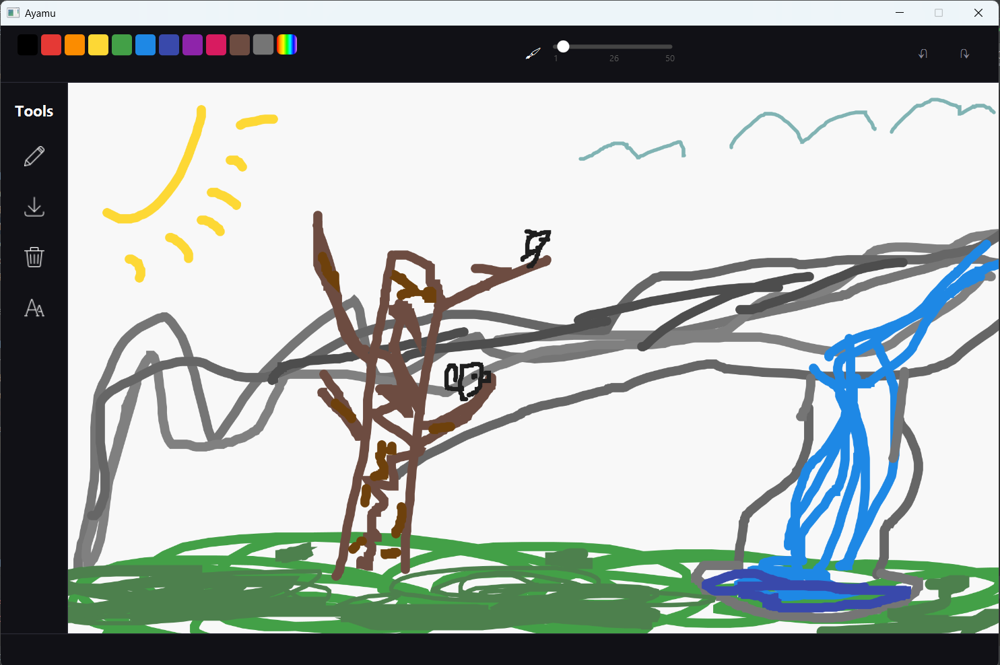

# Ayamu

### Why "Ayamu"?
Honestly, I’m not sure. It just sounded kind of cool.

### What is Aymau?

Ayamu is basically a very simple, lightweight version of Paint. I started this project to learn JavaFX and thought building a drawing app would be a fun challenge — not too easy, but not too hard (or so I thought).

It’s still missing a lot of features but here’s a preview of my progress so far.

